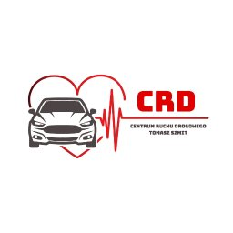

# 🏎️ CRD Tomasz Szmit - Premium Driving Team Website

Projekt rebrandingu i wdrożenia nowoczesnego serwisu internetowego dla Centrum Ruchu Drogowego. Strona charakteryzuje się drapieżnym, "wyścigowym" designem oraz bezkompromisową wydajnością.

## 🚀 Demo
[https://sosinskiweb.pl/crd/](https://sosinskiweb.pl/crd/)

## 🛠️ Stack Techniczny
* **Frontend:** HTML5 (Semantyczny), Tailwind CSS (Custom configurations).
* **UI/UX:** GLightbox (interaktywna galeria), FontAwesome Pro icons.
* **Wydajność:** Google Core Web Vitals Optimization (Score: 95+).
* **Logika:** JavaScript (Scroll effects, UI state management).

## 💎 Kluczowe cechy projektu

### 🎨 Rebranding & Visual Identity
Zaprojektowałem unikalny styl wizualny oparty na **Dark Mode** z intensywnymi czerwonymi akcentami. 
* Wykorzystanie motywu włókna węglowego (carbon fibre) w tle.
* Implementacja autorskich, "ściętych" przycisków (**skewed buttons**) nawiązujących do estetyki motoryzacyjnej.
* Zaawansowana typografia z efektem obrysu (*text-stroke*).

### ⚡ Optymalizacja Wydajności (Performance)
Mimo bogatej oprawy graficznej, strona osiąga wynik **95/100** w Google PageSpeed Insights dzięki:
* Minimalizacji krytycznego kodu CSS.
* Optymalizacji grafik pod kątem czasu ładowania (LCP).
* Wykorzystaniu asynchronicznego ładowania zewnętrznych bibliotek.

### 📸 Interaktywna Galeria
Zintegrowałem bibliotekę **GLightbox**, która zapewnia płynne i nowoczesne przeglądanie zasobów wizualnych na urządzeniach stacjonarnych i mobilnych (obsługa gestów).

### 📱 Full Responsive Design
Serwis jest w pełni responsywny, z dedykowanym, inteligentnym systemem przewijania do formularza zgłoszeniowego, który uwzględnia wysokość menu nawigacyjnego na urządzeniach mobilnych.

## 📁 Kluczowe pliki
* `index.html` - Główny landing page z sekcją "Driving Team".
* `galeria.php` - Dynamiczny moduł galerii zintegrowany z GLightbox.
* `cennik.html` - Przejrzyste pakiety cenowe z wyróżnieniem korzyści.
* `style.css` - Autorskie animacje i logika transformacji skośnych elementów.

---
*Developed by Paweł Sosiński - SosinskiWeb*
